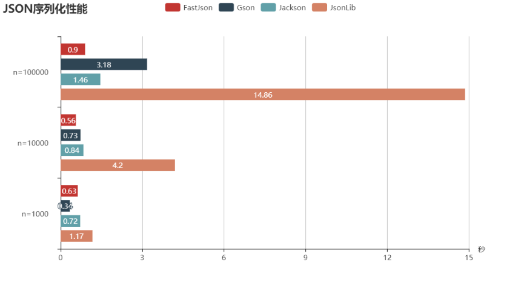
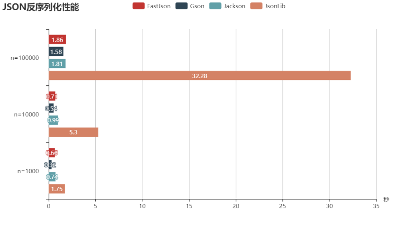

这4个JSON类库分别为：Gson，FastJson，Jackson，Json-lib。

## 背景
### Gson
项目地址：https://github.com/google/gson

Gson是目前功能最全的Json解析神器，Gson当初是为因应Google公司内部需求而由Google自行研发而来，但自从在2008年五月公开发布第一版后已被许多公司或用户应用。 Gson的应用主要为toJson与fromJson两个转换函数，无依赖，不需要例外额外的jar，能够直接跑在JDK上。 在使用这种对象转换之前，需先创建好对象的类型以及其成员才能成功的将JSON字符串成功转换成相对应的对象。 类里面只要有get和set方法，Gson完全可以实现复杂类型的json到bean或bean到json的转换，是JSON解析的神器。

### FastJson
项目地址：https://github.com/alibaba/fastjson

Fastjson是一个Java语言编写的高性能的JSON处理器,由阿里巴巴公司开发。无依赖，不需要例外额外的jar，能够直接跑在JDK上。 FastJson在复杂类型的Bean转换Json上会出现一些问题，可能会出现引用的类型，导致Json转换出错，需要制定引用。 FastJson采用独创的算法，将parse的速度提升到极致，超过所有json库。

### Jackson
项目地址：https://github.com/FasterXML/jackson

Jackson是当前用的比较广泛的，用来序列化和反序列化json的Java开源框架。Jackson社区相对比较活跃，更新速度也比较快， 从Github中的统计来看，Jackson是最流行的json解析器之一，Spring MVC的默认json解析器便是Jackson。

Jackson优点很多：
- Jackson 所依赖的jar包较少，简单易用。
- 与其他 Java 的 json 的框架 Gson 等相比，Jackson 解析大的 json 文件速度比较快。
- Jackson 运行时占用内存比较低，性能比较好
- Jackson 有灵活的 API，可以很容易进行扩展和定制。
- 目前最新版本是2.9.4，Jackson 的核心模块由三部分组成：

- jackson-core 核心包，提供基于”流模式”解析的相关 API，它包括 JsonPaser 和 JsonGenerator。Jackson 内部实现正是通过高性能的流模式 API 的 JsonGenerator 和 JsonParser 来生成和解析 json。
- jackson-annotations 注解包，提供标准注解功能；
- jackson-databind 数据绑定包，提供基于”对象绑定” 解析的相关 API（ ObjectMapper ）和”树模型” 解析的相关 API（JsonNode）；基于”对象绑定” 解析的 API 和”树模型”解析的 API 依赖基于”流模式”解析的 API。

### Json-lib
项目地址：http://json-lib.sourceforge.net/index.html

json-lib最开始的也是应用最广泛的json解析工具，json-lib 不好的地方确实是依赖于很多第三方包，对于复杂类型的转换，json-lib对于json转换成bean还有缺陷， 比如一个类里面会出现另一个类的list或者map集合，json-lib从json到bean的转换就会出现问题。json-lib在功能和性能上面都不能满足现在互联网化的需求。

## 四个库的工具类
- FastJsonUtil.java
```java
public class FastJsonUtil {
    public static String bean2Json(Object obj) {
        return JSON.toJSONString(obj);
    }

    public static <T> T json2Bean(String jsonStr, Class<T> objClass) {
        return JSON.parseObject(jsonStr, objClass);
    }
}
```
- GsonUtil.java
```java
public class GsonUtil {
    private static Gson gson = new GsonBuilder().create();

    public static String bean2Json(Object obj) {
        return gson.toJson(obj);
    }

    public static <T> T json2Bean(String jsonStr, Class<T> objClass) {
        return gson.fromJson(jsonStr, objClass);
    }

    public static String jsonFormatter(String uglyJsonStr) {
        Gson gson = new GsonBuilder().setPrettyPrinting().create();
        JsonParser jp = new JsonParser();
        JsonElement je = jp.parse(uglyJsonStr);
        return gson.toJson(je);
    }
}
```
- JacksonUtil.java
```java
public class JacksonUtil {
    private static ObjectMapper mapper = new ObjectMapper();

    public static String bean2Json(Object obj) {
        try {
            return mapper.writeValueAsString(obj);
        } catch (JsonProcessingException e) {
            e.printStackTrace();
            return null;
        }
    }

    public static <T> T json2Bean(String jsonStr, Class<T> objClass) {
        try {
            return mapper.readValue(jsonStr, objClass);
        } catch (IOException e) {
            e.printStackTrace();
            return null;
        }
    }
}
```
- JsonLibUtil.java
```java
public class JsonLibUtil {

    public static String bean2Json(Object obj) {
        JSONObject jsonObject = JSONObject.fromObject(obj);
        return jsonObject.toString();
    }

    @SuppressWarnings("unchecked")
    public static <T> T json2Bean(String jsonStr, Class<T> objClass) {
        return (T) JSONObject.toBean(JSONObject.fromObject(jsonStr), objClass);
    }
}
```
## 测试结果
- 序列化性能对比

- 包反序列化性能对比



## 使用建议
- 从上面的测试结果可以看出，序列化次数比较小的时候，Gson性能最好，当不断增加的时候到了100000，Gson明细弱于Jackson和FastJson， 这时候FastJson性能是真的牛，另外还可以看到不管数量少还是多，Jackson一直表现优异。而那个Json-lib简直就是来搞笑的。^_^

- 综上4种Json技术的比较，在项目选型的时候可以使用Google的Gson和阿里巴巴的FastJson两种并行使用，如果只是功能要求，没有性能要求，可以使用google的Gson，如果有性能上面的要求可以使用Gson将bean转换json确保数据的正确，使用FastJson将Json转换Bean。

- 从上面的测试结果可以看出，反序列化的时候，Gson、Jackson和FastJson区别不大，性能都很优异，而那个Json-lib还是来继续搞笑的。

## 参考
- https://blog.csdn.net/weixin_42476601/article/details/81700561
- https://www.xncoding.com/2018/01/09/java/jsons.html
