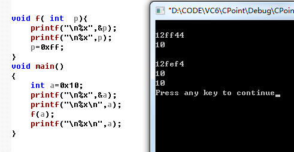
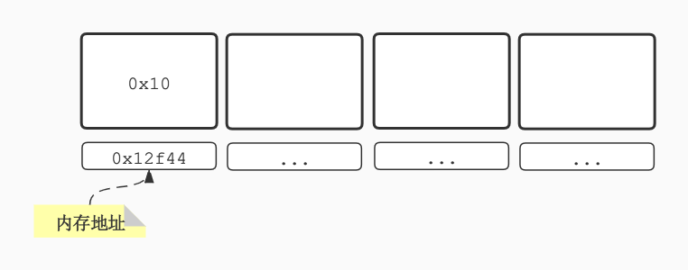
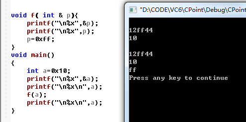
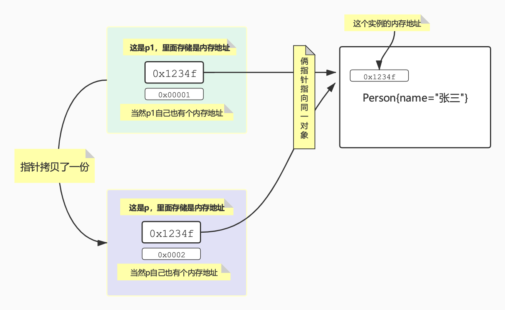
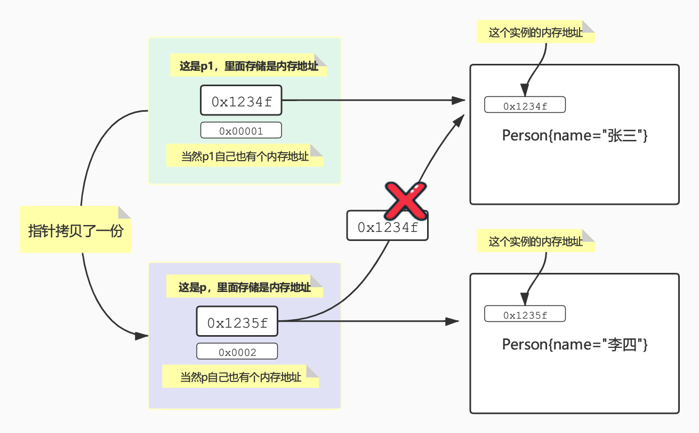

# Java到底是值传递还是引用传递

先说结论，Java中只有值传递，没有引用传递。值传递和引用传递的根本区别是有没有变量的**拷贝**，或者说有没有变量的**副本**。

啥叫值？值就是内存中真实存在的数据，就像碗里装的饭，盆里装的水一样。

啥叫引用？引用就是装值这块内存区域的地址，在碗上贴个标签写上张三，下次我要找张三的碗我直接看标签就行了，这个标签就是引用。（假设所有的碗颜色形状大小都一样）

啥叫指针？指针就是这块内存我不装数据了，装的是另外一块内存的地址，我在一个小碗里面装个标签，上面写着张三，通过这个小碗我找到了张三的大碗，你没看错，通过碗找碗，小碗找大碗，通过一小块内存找到一大块内存，就是指针。

啥叫值传递？把这块内存中的数据拷贝到另外一块内存里面去，把张三碗里面的饭原封不动的复制到另外一个碗里面去，另外一个碗拿着这碗饭开始消费数据，消费这碗饭里面的数据对张三碗里面的饭有影响吗？并没有，这就叫值传递。

啥叫引用传递？内存地址的传递叫作用传递，操作的都是同一块内存区域，我要吃饭（消费数据），把张三的碗上的标签给了我，那我自然找到张三的碗开始吃，这就叫引用传递。

啥叫指针传递？指针传递本质也是值传递！有个有张三标签的小碗，这个是个指针对不，现在把这个小碗里面的标签原封不动的复制到另外一个小碗里面去，那么两个小碗都能通过张三这个标签找到张三的碗，这是同一个碗嘛，这就叫指针传递。

# 什么是值传递

话不多说，直接看代码

```JAVA
public class PassByValue {
    public static void main(String[] args) {
        int a = 0;
        adder(a);
        System.out.println("main方法中的a为：" + a);
    }

    public static void adder(int b) {
        b = 1;
        System.out.println("方法adder中的b为：" + b);
    }
}
```

输出为

```
方法adder中的b为：1
main方法中的a为：0
```

**adder中的b是main中a的一个拷贝**，所以任何对b的操作不会影响到a，a该是多少还是多少，这就是值传递。值传递传递的是原始变量的一个**拷贝**，这个就是关键！

来看看C版本的，一模一样的有没有发现。

```c
void f( int  p){
	printf("\n%x",&p);
	printf("\n%x",p);
	p=0xff;
}
void main()
{
	int a=0x10;
	printf("\n%x",&a);
	printf("\n%x\n",a);
	f(a);
	printf("\n%x\n",a);
}
```

执行如下图




# 什么是引用传递

引用传递，那就是传递这根儿引用，千万别和Java里面的**引用类型**混淆，这里说的是**引用**，不是**引用类型**，**引用类型**四个字儿呢，这俩字儿叫**引用**，哪这根儿引用到底是个啥？ 说白了就是**内存地址**。**引用传递操作的都是同一块内存**

## 内存地址

**引用就是内存地址**



内存地址如上图所示，你可以把它想象成一条无限长的纸条，纸条上面的每个格子是一个内存单位，就是实际放东西的地方，纸条下面的格子就是这块内存的内存地址，就是一个位置，通过这个位置可以拿到这块内存中实际存放的东西，通常我们说的寻址，就是通过这么个地址找到这块内存！

## 引用传递

上面说了，**引用就是内存地址**，那么引用传递也就是这块内存地址的传递，怎么个传递法？以C语言为例（Java中没有引用传递，所以要类比C中的引用传递才能帮助理解）

```C
void f( int & p){
	printf("\n%x",&p);
	printf("\n%x",p);
	p=0xff;
}
void main()
{
	int a=0x10;
	printf("\n%x",&a);
	printf("\n%x\n",a);
	f(a);
	printf("\n%x\n",a);
}
```

f的入参```& p```就表示一个引用（内存地址），```p```表示这块内存地址中实际装着的值，看下运行结果



不出意外，```main```中的a也被改掉了，```main```中的```a```和```f```中的```p```实际上表示的是同一块内存！当然改了一个另外一个也被影响了！

整个过程都在操作一块内存，没有内存被**拷贝**！这才是正儿八经的引用传递


# Java中引用类型的值传递和正儿八经的引用传递有啥区别？

很多人都在这里混淆，Java中引用类型的传递不就是引用传递？人家叫引用类型的值传递，你简称引用传递，后面四个字被你吃了？？引用类型实际上都是指针，你也可以说成是**指针传递**！

## Java中的指针

先看看Java中最具误导性的例子

```java
public class PassByValueForReference {

    public static void main(String[] args) {
        Person p1 = new Person("张三");
        System.out.println("改名之前的person：" + p1);
        nameChanger(p1);
        System.out.println("改名之后的person：" + p1);
    }


    static void nameChanger(Person p){
        p.name = "李四";
    }

    private static class Person{
        String name;
        public Person(String name) {
            this.name = name;
        }

        @Override
        public String toString() {
            return this.name;
        }
    }
}

```

输出结果如下：

```
改名之前的person：张三
改名之后的person：李四
```

张三的引用```p1```被传递到```nameChanger```方法里面，然后```nameChanger```拿到张三的引用p执行改名操作后，main里面的张三变成了李四，这不就是引用传递！？

当然不是！首先p1不是个引用，p1是个指针！什么指针？指向张三的指针！Java中的引用类型是栈上的一小块内存（通常为4字节）指向堆上的一大块内存，这小块内存里面放的不是真正的数据，而是存的堆上大块内存的**内存地址**！这不就是指针么。

其次，```nameChanger```拿到的并不是张三的引用p，而是张三的指针p1的**拷贝**，小本本记下来，又出现了**拷贝**这个词了，既然是张三的指针那当然指向张三了，既然是张三的指针那当然也能指向别的Person，比如李四、王麻子

总而言之，言而总之，```Person p1 = new Person("张三");```，```    static void nameChanger(Person p)```中的p1和p都是指针，不是真正的引用！ 一图胜千言




## Java中的指针传递

把上面的例子稍微改一下，就改动了一行代码

```JAVA
public class PassByValueForReference {

    public static void main(String[] args) {
        Person p1 = new Person("张三");
        System.out.println("改名之前的person：" + p1);
        nameChanger(p1);
        System.out.println("改名之后的person：" + p1);
    }


    static void nameChanger(Person p){
        //p.name = "李四";
        p = new Person("李四");
    }

    private static class Person{
        String name;
        public Person(String name) {
            this.name = name;
        }

        @Override
        public String toString() {
            return this.name;
        }
    }
}

```

输出结果

```
改名之前的person：张三
改名之后的person：张三
```

看到没，```nameChanger```并没影响到```main```，按理说**引用传递操作的都是同一块内存**，所以```main```中的也应该是李四，但实际证明并不是，这也从侧面说明Java中没有引用传递！

上面的操作如下图所示：



所以最后明白了么？Java中没有引用，全都是指针！引用类型就是指针！Java中著名的异常都叫空指针异常，所以你明白了吧。