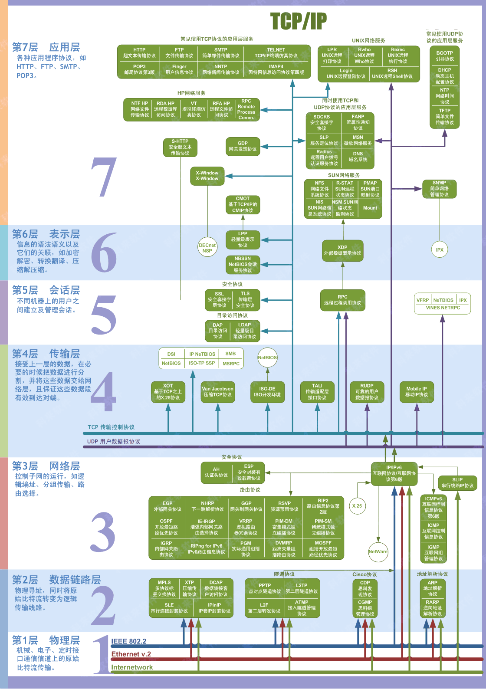

# OCP网络之Open vSwitch详解

提到网络，不得不提到网络模型，下面一起来复习一下网络模型

## 网络模型之OSI七层模型

> OSI：**开放式系统互联模型**（英语：**O**pen **S**ystem **I**nterconnection Model，缩写：OSI；简称为**OSI模型**）是一种[概念模型](https://zh.wikipedia.org/wiki/概念模型)，由[国际标准化组织](https://zh.wikipedia.org/wiki/国际标准化组织)提出，一个试图使各种计算机在世界范围内互连为网络的标准框架。定义于ISO/IEC 7498-1。




### 第 7 层应用层 (Application Layer)

**主要功能：** 为应用软件提供接口，使应用程序能够使用网络服务
**典型设备：** 网关
**典型协议、标准和应用：** http(80)、ftp(20/21)、smtp(25)、pop3(110)、telnet(23)、dns(53)

### 第 6 层表示层 (Presentation Layer)

**主要功能：** 数据的解码和编码，数据的加密和解密，数据的压缩和解压缩
**典型设备：** 网关
**典型协议、标准和应用：** ASCLL、PICT、TIFF、JPEG、 MIDI、MPEG

### 第 5 层会话层 (Session Layer)

**主要功能：** 建立、维护、管理应用程序之间的会话
**典型设备：** 网关
**典型协议、标准和应用：** RPC、SQL、NFS 、X WINDOWS、ASP

### 第 4 层传输层 (Transport Layer)

**主要功能：** 负责建立端到端的链接，保证保温在端到端之间的传输
**典型设备：** **网关**
**典型协议、标准和应用：** TCP、UDP、SPX

### 第 3 层网络层 (Network Layer)

**主要功能：** 负责将分组数据从源端传输到目的端，网络层的主要作用就是路由和寻址
**典型设备：** **路由器**
**典型协议、标准和应用：** IP、IPX、APPLETALK、ICMP

### 第 2 层数据链接层 (Data Link Layer)

**主要功能：** 在不可靠的物理链路上，提供可靠的数据传输服务
**典型设备：** **交换机**、网桥、网卡
**典型协议、标准和应用：** 802.2、802.3ATM、HDLC、FRAME RELAY

### 第 1 层物理层 (Physical Layer)

**主要功能：** 利用传输介质为数据链路层提供物理连接，实现比特流的透明传输
**典型设备：** 集线器、中继器
**典型协议、标准和应用：** V.35、EIA/TIA-232


OSI七层网络模型还有一个详细版本的，缩略图如下


- 发布地址为：http://www.colasoft.com.cn/download/protocols_map.php，

- 下载地址：[network-protocol-map-2020.pdf](files/OpenShift网络之Open_vSwitch详解/network-protocol-map-2020.pdf)

### TCP/IP 协议

在实际编程过程之中，接触到的更多的是TCP/IP协议模型，它是对OSI七层模型进行"掐头"或"去尾"，有四层的，也有五层的，下面是OSI和TCP/IP对照关系图


### 数据包的封装传送过程

发送端：每往下一层，都会在上层的基础之上封一个包头，在最底层通过010101...的比特流进行传输

接收端：物理层接收到比特流后每往上一层都解封该层的包头

**分层解耦**：下层的操作不会影响到上层


## OpneShift安装

安装教程请参考之前的文章：[CentOS7.9上部署OpenShift3.11集群](2021-06-20_CentOS7.9上部署OpenShift3.11集群.md)


## Pod内部的网络通信

Pod内部的通信是通过共享网络namespace实现的，还设计不到Open vSwitch

- Pod

> Pod （就像在鲸鱼荚或者豌豆荚中）是一组（一个或多个） [容器](https://kubernetes.io/zh/docs/concepts/overview/what-is-kubernetes/#why-containers)； 这些**容器共享存储、网络**、以及怎样运行这些容器的声明。
>
> 同一个Pod之间可以通过**localhost**进行通信

- 容器

> 容器的实质是**进程**，但与直接在宿主执行的进程不同，容器进程运行于属于自己的独立的 [命名空间](https://en.wikipedia.org/wiki/Linux_namespaces)。因此容器可以拥有自己的 `root` **文件系统**、自己的**网络配置**、自己的**进程**空间，甚至自己的用户 ID 空间。
>
> **容器内的进程是运行在一个隔离的环境里**，使用起来，就好像是在一个独立于宿主的系统下操作一样。这种特性使得容器封装的应用比直接在宿主运行更加安全。**也因为这种隔离的特性**，很多人初学 Docker 时常常会混淆容器和虚拟机。

容器既可以隔离资源，容器之间也能共享资源，比如共享网络，资源的**隔离和共享**是通过namespace技术来实现的

### Linux namespace

| namespace | 全称                       | 系统调用参数  | 隔离内容                   | 内核版本 |
| --------- | -------------------------- | ------------- | -------------------------- | -------- |
| UTS       | UNIX Time-Sharing          | CLONE_NEWUTS  | 主机名或域名               | 2.6.19   |
| IPC       | Interprocess Communication | CLONE_NEWIPC  | 信号量、消息队列和共享内存 | 2.6.19   |
| PID       | Process ID                 | CLONE_NEWPID  | 进程编号                   | 2.6.24   |
| Network   | Network                    | CLONE_NEWNET  | 网络设备、网络栈、端口登   | 2.6.29   |
| Mount     | Mount                      | CLONE_NEWNS   | 挂载点（文件系统）         | 2.4.19   |
| User      | User ID                    | CLONE_NEWUSER | 用户和用户组               | 3.8      |
系统调用参数就是传递给系统调用`clone`函数的参数

```c
//创建并启动子进程，调用该函数后，父进程将继续往后执行，也就是执行后面的waitpid
clone(child_func,  //子进程将执行child_func这个函数
      child_stack + sizeof(child_stack),//栈是从高位向低位增长，所以这里要指向高位地址
      //CLONE_NEWUTS表示创建新的UTS namespace，
      //这里SIGCHLD是子进程退出后返回给父进程的信号，跟namespace无关
      CLONE_NEWUTS | SIGCHLD,
      argv[1]);  //传给child_func的参数
```

两个容器处于不同的namespace那么资源就是隔离的，如果在同一个namespace中那么资源就是共享的，更多详细的namespace的细节，可以参考如下链接

- https://en.wikipedia.org/wiki/Linux_namespaces
- https://www.cnblogs.com/bakari/p/8560437.html
- https://coolshell.cn/articles/17010.html
- https://coolshell.cn/articles/17029.html

### pause容器

pause容器运行着一个非常简单的进程，它不执行任何功能，一启动就永远把自己阻塞住了。

- 在 Pod 中它作为共享 Linux Namespace（Network、UTS 等）的基础

- 启用 PID Namespace 共享，它为每个 Pod 提供 1 号进程，并收集 Pod 内的僵尸进程。

在K8S集群上面随便找一个计算节点，然后执行`docker ps | grep pause`就可以看到很多`pause`的容器

更多pause容器相关的内容可参考：https://segmentfault.com/a/1190000021710436

#### ose-pod

在OpenShift集群中，也是有pause容器的，但是名字叫做ose-pod，下面是官方介绍

> This is a component of Atomic OpenShift and holds on to the shared Linux namespaces within a Pod.

- https://catalog.redhat.com/software/containers/openshift3/ose-pod/57ea8d029c624c035f96f424?container-tabs=overview

在集群中找一个计算节点，然后执行`docker ps | grep ose-pod`可以看到很多容器，理论上有多少个Pod就会有多少的`ose-pod`容器

在有些版本中又叫**origin-pod**，如果没找到`ose-pod`，可以试试找`origin-pod`

### Pod内部通信实战

首先创建一个含有多个容器的Pod，这里以tomcat和nginx为例，在一个Pod中，tomcat跑在8080端口，nginx跑在80端口，编排文件如下，应用下面的编排文件就可以得到一个两个容器的Pod（准确的说是三个，因为还有一个pause容器）

```yaml
apiVersion: apps/v1
kind: Deployment
metadata:
  labels:
    app: tomcat-nginx
  name: tomcat-nginx
spec:
  replicas: 1
  selector:
    matchLabels:
      app: tomcat-nginx
  strategy: {}
  template:
    metadata:
      labels:
        app: tomcat-nginx
    spec:
      containers:
      - image: kirillf/centos-tomcat
        name: tomcat
      - image: nginx:1.14
        name: nginx
```

#### 网络namespace共享

1. 在目标机器上，找到该Pod下面的三个容器，如下

```bash
docker ps | grep tomcat-nginx

4b216fbc730c        295c7be07902            "nginx -g "   # nginx
c67c36070427        kirillf/centos-tomcat   "tomcat.sh"   # tomcat
563b2ca05e60        openshift/origin-pod                  # pause容器
```

2. 查看pause容器的长Id

```bash
docker inspect --format='{{.Id}}' 563b2ca05e60

563b2ca05e60811d71f464e6eed8a323c5eba288565704490f591c60845d751b
```

3. 查看nginx和tomcat容器，可以发现它们的`NetworkMode`都是引用的pause容器的，因此它们的网络namespace是共享的，因为Id就是上面pause容器的Id

```bash
docker inspect --format='{{.HostConfig.NetworkMode}}' 4b216fbc730c
docker inspect --format='{{.HostConfig.NetworkMode}}' c67c36070427

# 返回如下，此Id就是上面pause容器的Id
container:563b2ca05e60811d71f464e6eed8a323c5eba288565704490f591c60845d751b
```

那么在docker中怎么才能实现这样的效果呢？有一个参数`--net`可以指定

- `--net=container:NAME_or_ID` 让 Docker 将新建容器的进程放到一个已存在容器的网络栈中，新容器进程有自己的文件系统、进程列表和资源限制，但会和已存在的容器共享 IP 地址和端口等网络资源，两者进程可以直接通过 `lo` 环回接口通信。类似命令如下：

```bash
docker run -d --name pause origin-pod
docker run -d --net=container:pause tomcat
docker run -d --net=container:pause nginx
```

---

上面是在docker中证明了它们的网络namespace是共享的，下面通过`/proc/$$/ns`来证明，每个进程都有一个`/proc/[pid]/ns/`子目录，每个namespace都会在里面产生一个条目，`$$`指的是当前bash的`pid`

分别进入tomcat、nginx、pause三个容器，执行`ls -l /proc/$$/ns | awk '{print $1, $9, $10, $11}'`查看它们的namepsace条目，结果如下

```properties
# tomcat的
lrwxrwxrwx. ipc -> ipc:[4026532611]   # 三者相同
lrwxrwxrwx. mnt -> mnt:[4026532686]
lrwxrwxrwx. net -> net:[4026532614]   # 三者相同
lrwxrwxrwx. pid -> pid:[4026532688]
lrwxrwxrwx. user -> user:[4026531837] # 三者相同
lrwxrwxrwx. uts -> uts:[4026532687]


# nginx的
lrwxrwxrwx. ipc -> ipc:[4026532611]   # 三者相同
lrwxrwxrwx. mnt -> mnt:[4026532683]
lrwxrwxrwx. net -> net:[4026532614]   # 三者相同
lrwxrwxrwx. pid -> pid:[4026532685]
lrwxrwxrwx. user -> user:[4026531837] # 三者相同
lrwxrwxrwx. uts -> uts:[4026532684]

# pause容器的
lrwxrwxrwx. ipc -> ipc:[4026532611]   # 三者相同
lrwxrwxrwx. mnt -> mnt:[4026532609]
lrwxrwxrwx. net -> net:[4026532614]   # 三者相同
lrwxrwxrwx. pid -> pid:[4026532612]
lrwxrwxrwx. user -> user:[4026531837] # 三者相同
lrwxrwxrwx. uts -> uts:[4026532610]

```

可以看到ipc、net、user三个namespace是相同的，也就证明了它们是共享的

#### 测试容器间环回接口

上面只是看到了一些ID和数字相同，现在我们可以直接进入容器里面看看本地环回接口容器间是否相同，因为tomcat跑在8080，nginx跑在80，所以只需要在tomcat容器里面测试nignx的端口，在nginx容器里面测试tomcat的端口，如果可以互相访问，则证明网络是共享的

- 在nginx里面测试tomcat的8080端口，如果有返回说明符合预期

```bash
# nginx镜像是debian的，可能没有curl命令，需要安装一下
apt update && apt upgrade && apt install curl

# 在nignx容器里面访问tomcat容器的80880端口
docker exec 4b216fbc730c curl 127.0.0.1:8080
```

- 在tomcat容器里面访问nginx的80端口，如果有返回说明符合预期

```bash
docker exec c67c36070427 curl 127.0.0.1:80
```


## 同一Node上Pod的网络通信

Pod内部的网络通过共享namespace就可以实现了，那同一Node上Pod之间的网络通信呢？


### OpenShift 中的网络插件

为了OpenShift 集群中 pod 之间的网络通信，OpenShift 以插件形式提供了三种符合Kubernetes CNI 要求的 SDN实现：更多详细介绍，可参考：https://docs.openshift.com/container-platform/3.11/architecture/networking/sdn.html

- `ovs-subnet`：`ovs-subnet` 实现的是一种扁平网络，未实现租户之间的网络隔离，这意味着所有租户之间的pod 都可以互访，这使得该实现无法用于绝大多数的生产环境。
- `ovs-multitenant`：基于 OVS 和 VxLAN 等技术实现了项目（project）之间的网络隔离。
- `ovs-networkpolicy`：介于`ovs-subnet` 和 `ovs-multitenant` 之间的一种实现。考虑到 `ovs-multitenant` 只是实现了项目级别的网络隔离，这种隔离粒度在一些场景中有些过大，用户没法做更精细的控制，这种需求导致了`ovs-networkpolicy`的出现。默认地，它和`ovs-subnet` 一样，所有租户之间都没有网络隔离。但是，管理员可以通过定义 `NetworkPolicy` 对象来精细地进行网络控制。可以粗略地将它类比为OpenStack neutron 中的neutron 网络防火墙和Nova安全组

当使用 ansible 部署 OpenShift 时，默认会启用`ovs-subnet`，但是可以在部署完成后修改为其它两种实现。

查看OCP集群使用的是何种网络插件以及集群Pod网络地址空间，随便在集群中找一台Master角色机器登录进去

```bash
# 查看网络插件
grep networkPluginName -A 2 /etc/origin/master/master-config.yaml
  networkPluginName： redhat/openshift-ovs-networkpolicy

# 查看Pod网络地址空间
grep clusterNetworks -A 2 /etc/origin/master/master-config.yaml
  clusterNetworks:
  - cidr: 175.7.0.0/16
```

当一个节点加入OpenShift集群后，在上面会创建三个网络设备

- `br0`：所有本地Pod都会被连到这个OVS网桥上，可以看做成一个虚拟的交换机
- `tun0`：OVS内部内部端口（连在br0的2号端口），用于外部网络的访问（配合NAT地址转换）
- `vxlan_sys_4789`：OVS VXLAN（连在br0的1号端口）隧道，用于和其他节点的Pod通信

### Open vSwitch

这是OCP网络插件底层所用的网络技术，全称**Open Virtual Switch**，简称`OVS`，从网络插件`ovs-networkpolicy`的名字就可以看出来它是基于Open vSwitch，看看什么是Open vSwitch

> Open vSwitch是一个高质量的、多层**虚拟交换机**，使用开源Apache2.0许可协议，由Nicira Networks开发，主要实现代码为可移植的C代码。它的目的是让大规模网络自动化可以通过编程扩展,同时仍然支持标准的管理接口和协议（例如NetFlow, sFlow, SPAN, RSPAN, CLI, LACP, 802.1ag） 
>
> 简而言之，Open vSwitch 即**开放的软件虚拟交换机**，能够达到产品级的质量，也就是说可以部署一些生产环境使用。它不光支持基本的二层交换，还支持标准的管理机接口和协议（e.g. NetFlow,sFlow,SPAN,RSAPN,CLI,LACP,802.1ag），同时也支持 **OpenFlow**，可以很好的与 SDN 体系融合。

简单理解就是一个工作在**2层数据链路层**的**虚拟交换机**，**Virtual Switch**就是虚拟交换机的意思

- 官网文档：https://docs.openvswitch.org/en/latest/

### OpenFlow

> **OpenFlow**，一种网络通信协议，属于[数据链路层](https://zh.wikipedia.org/wiki/数据链路层)，能够控制[网络交换器](https://zh.wikipedia.org/wiki/網路交換器)或[路由器](https://zh.wikipedia.org/wiki/路由器)的[转发平面](https://zh.wikipedia.org/w/index.php?title=转发平面&action=edit&redlink=1)（forwarding plane），借此改变网络数据包所走的网络路径。

#### OpenShift OVS流表

具体到OpenShift来说，其流表路径大致归纳如下

- table 0: 做入口分流，来自VXLAN隧道/本节点的容器/其他节点的流量分别分流到table 10/20/30；
- table 10: 做入口合法性检查，如果隧道的远端IP是集群节点的IP，就认为是合法，继续转到table 30去处理;
- table 20: 做入口合法性检查，如果数据包的源MAC和IP等数据与来源端口（veth）一致，就认为是合法的，设置源项目标记，继续转到table 30去处理；如果不一致，即可能存在ARP/IP欺诈，则认为这样的的数据包是非法的;
- table 30: 做数据包的目的（目的IP或ARP请求的IP）做转发分流，分别转到table 40~70 去处理;
- table 40: 本地ARP的转发处理，根据ARP请求的IP地址，从对应的端口（veth）发出;
- table 50: 远端ARP的转发处理，根据ARP请求的IP地址，设置VXLAN隧道远端IP，并从隧道发出;
- table 60: Service的转发处理，根据目标Service，设置目标项目标记和转发出口标记，转发到table 80去处理;
- table 70: 本地IP的转发处理，根据目标IP，设置目标项目标记和转发出口标记，转发到table 80去处理;
- table 80: 做本地的IP包转出合法性检查，检查源项目标记和目标项目标记是否匹配，或者目标项目是否是公开的，如果满足则转发;
- table 90: 做远端IP包转发“寻址”，根据目标IP，设置VXLAN隧道远端IP，并从隧道发出;
- table 100: 做出外网的转出处理，将数据包从tun0发出。


这个图很有用，下面打印出来的流表可以结合这个图做验证！

### 实战

#### 查看OCP生成的网络设备

- 查看`tun0`和`vxlan_sys_4789`，到目标node上用`ifconfig`命令即可

```bash
$ ifconfig

tun0: flags=4163<UP,BROADCAST,RUNNING,MULTICAST>  mtu 1450
        inet 10.130.0.1  netmask 255.255.254.0  broadcast 10.130.1.255
        ...
        
vxlan_sys_4789: flags=4163<UP,BROADCAST,RUNNING,MULTICAST>  mtu 65535
        inet6 fe80::84a2:f5ff:fe1b:8d0a  prefixlen 64  scopeid 0x20<link>
       ...
```

- 查看虚拟网桥`br0`，这个比较麻烦一点，需要通过跑在具体node上ovs的Pod查看

1. 找到目标node上ovs的Pod

```bash
oc get pod -o wide -n openshift-sdn | grep ovs | grep <node name>

ovs-v668h   1/1  Running   0  50d  ....
```

2. 进入到目标ovs容器

```bash
# 进入ovs容器
oc rsh -n openshift-sdn <ovs Pod名>
```

3. 查看OVS网桥，所谓网桥，可以理解成一个虚拟交换机

```bash
# 查看已存在的网桥
ovs-vsctl list-br

# 这就是传说中的br0网桥
br0
```

4. 查看网桥br0更多详细情况

```bash
# 查看网桥上有哪些设备
ovs-vsctl list-ports br0

tun0
veth92727375
vethd83c05d3
vxlan0


# 查看网桥详细情况
ovs-vsctl show

db5c9237-3466-4198-b6bb-18d3a522b19d
    Bridge "br0"
        fail_mode: secure
        Port "vethd83c05d3"
            Interface "vethd83c05d3"
        Port "vxlan0"
            Interface "vxlan0"
                type: vxlan
                options: {dst_port="4789", key=flow, remote_ip=flow}
       ...
    ovs_version: "2.7.0"


# 查看更详细的情况,OpenFlow13表示OpenFlow协议版本
# 注意这里就可以看到端口号了，1号端口是vxlan0，2号端口是tun0
ovs-ofctl -O OpenFlow13 show br0

capabilities: FLOW_STATS TABLE_STATS PORT_STATS GROUP_STATS QUEUE_STATS
OFPST_PORT_DESC reply (OF1.3) (xid=0x3):
 1(vxlan0): addr:9a:0a:3b:e5:0d:7d
     config:     0
     state:      0
     speed: 0 Mbps now, 0 Mbps max
 2(tun0): addr:0e:27:bb:b8:68:81
     config:     0
     state:      0
     speed: 0 Mbps now, 0 Mbps max
 3(veth92727375): addr:32:1e:47:5f:be:87
     config:     0
     state:      0
     current:    10GB-FD COPPER
     speed: 10000 Mbps now, 0 Mbps max
 4(vethd83c05d3): addr:d6:a1:41:2e:0b:87
     config:     0
     state:      0
     current:    10GB-FD COPPER
     speed: 10000 Mbps now, 0 Mbps max
 LOCAL(br0): addr:12:df:eb:8f:24:41
     config:     PORT_DOWN
     state:      LINK_DOWN
     speed: 0 Mbps now, 0 Mbps max
OFPT_GET_CONFIG_REPLY (OF1.3) (xid=0x5): frags=nx-match miss_send_len=0
```

注意：默认情况下，**1号端口是vxlan0**，**2号端口是tun0**

#### Pod之间通信

同一个Node里面的两个Pod，通过br0网桥直接就可以通信

网络路径：：pod1的eth0 → veth34 → br0 → veth12 → pod2的eth0 


##### 流表查看

1. 查看业务容器的容器ID

```bash
oc get po <Pod名字> -o yaml | grep -A 1 containerID
```

2. 到对应的node上找到该容器的Pid（在宿主机上的ID）

```bash
docker inspect <容器ID> | grep Pid
```

3. 查看该Pid对应的虚拟网卡

```bash
# 查看网络接口
nsenter -t <容器Pid> -n ip a
3: eth0@if230
# 查看网络接口对应的虚拟网卡
ip link | grep 230
230: vethxxxxxx
```

4. 进入对应节点的ovs容器里面

```bash
# 找到对应的Pod
oc get pod -o wide -n openshift-sdn | grep ovs | grep <node name>
# 进入ovs容器
oc rsh -n openshift-sdn <ovs容器名>
```

5. 在ovs容器里面找到虚拟网卡在br0网桥上的端口

```bash
ovs-ofctl -O OpenFlow13 show br0 | grep <虚拟网卡名字>

223(vethxxxx)
# 前面的223就是虚拟网卡vethxxxx在br0网桥上的端口
```

6. 查看流表路径，它可以模拟出流量的转发路径

```bash
ovs-appctl ofproto/trace br0 in_port=<上面查的端口>,tcp,nw_src=<Pod1的ip>,nw_dst=<Pod2的ip>,ct_state=trk
```

上面是通用规则，下面举一个例子，Pod信息如下，可以看到它们是同一个节点上的

```bash
tomcat-nginx-6cf8c89cd7   10.130.0.6   node2.ocp.cn
web-76c94f7546-t8pfq      10.130.0.5   node2.ocp.cn
```

通过上面的方法，可以得知交换机端口号对应信息

```
端口号  虚拟网卡       集群IP      Pod
3     veth92727375  10.130.0.5  web-76c94f7546-t8pfq
4     vethd83c05d3  10.130.0.6  tomcat-nginx-6cf8c89cd7
```

下面我们查看`10.130.0.6`到`10.130.0.5`的流表

```bash
ovs-appctl ofproto/trace br0 in_port=4,tcp,nw_src=10.130.0.6,nw_dst=10.130.0.5,ct_state=trk
```

流表输出如下：

```properties
bridge("br0")
-------------
 0. ip, priority 100
    goto_table:20
20. ip,in_port=4,nw_src=10.130.0.6, priority 100
    load:0->NXM_NX_REG0[]
    goto_table:21
21. priority 0
    goto_table:30
30. ip,nw_dst=10.130.0.0/23, priority 200
    goto_table:70
70. ip,nw_dst=10.130.0.5, priority 100
    load:0->NXM_NX_REG1[]
    load:0x3->NXM_NX_REG2[]
    goto_table:80
80. priority 200
    output:NXM_NX_REG2[]
     -> output port is 3

```

路径是`0 > 20 > 30 > 70 > 80`（有个21是啥暂时还不清楚）

结合上面OpenShift OVS流表路径图可以证明同一Node上不同Pod的网络通信是走的br0网桥，table70刚好就是做本地转发，`output port is 3`最后从3号端口出去了，3号端口正好的Pod2网卡在网桥br0上的端口

#### 查看所有流表

当然，也可以看流表的所有内容，命令如下

```bash
ovs-ofctl -O OpenFlow13 dump-flows br0

# 查看编号为10的流表
ovs-ofctl -O OpenFlow13 dump-flows br0 table=10
```

## 不同Node上Pod的网络通信


Pod信息如下，可以看到，两个Pod是在不同node上的

```properties
tomcat-nginx-6cf8c89cd7   10.130.0.6   node2.ocp.cn
tomcat-7f646bb995-b8bhr   10.131.0.4   node1.ocp.cn
```

交换机端口号信息

```properties
端口号  虚拟网卡       集群IP      Pod
4     vethd83c05d3  10.130.0.6  tomcat-nginx-6cf8c89cd7
```


### 源Pod到VXLAN隧道的流表

```bash
ovs-appctl ofproto/trace br0 in_port=4,tcp,nw_src=10.130.0.6,nw_dst=10.131.0.4,ct_state=trk
```

输出如下

```bash
bridge("br0")
-------------
 0. ip, priority 100
    goto_table:20
20. ip,in_port=4,nw_src=10.130.0.6, priority 100
    load:0->NXM_NX_REG0[]
    goto_table:21
21. priority 0
    goto_table:30
30. ip,nw_dst=10.128.0.0/14, priority 100
    goto_table:90
90. ip,nw_dst=10.131.0.0/23, priority 100, cookie 0x67575db9
    move:NXM_NX_REG0[]->NXM_NX_TUN_ID[0..31]
     -> NXM_NX_TUN_ID[0..31] is now 0
    set_field:192.168.108.111->tun_dst
    output:1
     -> output to kernel tunnel

```

结合流表路径图可以看到table90是远程IP转发，下一步就是VXLAN，`output:1`说明流量从端口号为1的设备输出了，而端口号为1的设备就是`vxlan0`！

### VXLAN到目标Pod的流表

VXLAN到目标Pod的流表查看的参数要注意一下了，这里没有源IP（即`nw_src`参数）了，因为`in_port`和源IP是绑定的，而这里的`in_port`是`vxlan0`，它是二层交换机设备没有IP地址的，那应该填什么呢？首先看流表路径图发现VXLAN验证的流表是table10，所以我们先看下table10有些啥内容

```bash
ovs-ofctl -O OpenFlow13 dump-flows br0 table=10


# 返回内容如下
table=10, n_packets=311, n_bytes=48166, priority=100,tun_src=192.168.108.113 actions=goto_table:30
table=10, n_packets=8, n_bytes=595, priority=100,tun_src=192.168.108.110 actions=goto_table:30
table=10, n_packets=0, n_bytes=0, priority=100,tun_src=192.168.108.112 actions=goto_table:30
table=10, n_packets=0, n_bytes=0, priority=0 actions=drop
```

可以看到前三条都有一个`tun_src`字段，内容正是我们集群中node的ip，这里`nw_src`参数应该替换成`tun_src`参数，所以命令应该这么写

```bash
# in_port填1，表示vxlan0
# tun_src填写源Pod所在的Node的IP
ovs-appctl ofproto/trace br0 in_port=1,tcp,tun_src=192.168.108.112,nw_dst=10.131.0.4,ct_state=trk
```

最后输出如下

```properties
bridge("br0")
-------------
 0. ip,in_port=1,nw_dst=10.128.0.0/14, priority 200
    move:NXM_NX_TUN_ID[0..31]->NXM_NX_REG0[]
     -> NXM_NX_REG0[] is now 0
    goto_table:10
10. tun_src=192.168.108.112, priority 100, cookie 0xda64d3ae
    goto_table:30
30. ip,nw_dst=10.131.0.0/23, priority 200
    goto_table:70
70. ip,nw_dst=10.131.0.4, priority 100
    load:0->NXM_NX_REG1[]
    load:0x3->NXM_NX_REG2[]
    goto_table:80
80. priority 200
    output:NXM_NX_REG2[]
     -> output port is 3

```

结合流表路径图可以看出从vxlan0出来之后就直接转发给本机的Pod了！

如果`tun_src`参数填写当前Node的IP结果会是怎样呢？结果就是在table10通不过验证，vxlan0隧道来的流量不应该是本机的，所以直接丢弃

```bash
ovs-appctl ofproto/trace br0 in_port=1,tcp,tun_src=192.168.108.111,nw_dst=10.131.0.4,ct_state=trk

# 在table10没通过验证，vxlan0隧道来的流量不应该是本机的，所以直接丢弃
bridge("br0")
-------------
 0. ip,in_port=1,nw_dst=10.128.0.0/14, priority 200
    move:NXM_NX_TUN_ID[0..31]->NXM_NX_REG0[]
     -> NXM_NX_REG0[] is now 0
    goto_table:10
10. priority 0
    drop
```

### 路由

由于是通过隧道链接不同Node之间的Pod，所以网络流量并不会经过网关，路由追踪一下，可以验证源Pod到目标Pod的流量并不会经过tun0（即网关），查看`10.130.0.6`到`10.130.0.4`的路由

```bash
$ traceroute  10.131.0.4

traceroute to 10.131.0.4 (10.131.0.4), 30 hops max, 60 byte packets
1  10.131.0.4 (10.131.0.4)  22.683 ms  22.829 ms *

```

可以看到路由没有经过网关直接到达了`10.130.0.4`，符合预期。

## Pod与集群外部网络的通信


当Pod需要访问外部地址的时候，首先会将数据发送给br0网桥，根据**流表**将数据发送给在流表上2号端口的tun0（充当Pod网关的角色）

然后流量会流入iptables规则，根据`POSTROUTING`规则做源地址转换将Pod的地址转换成当前节点的地址，然后再从当前节点的eth0网卡发送出去，最后经过节点所在网络的交换机或路由器，最终到达目标地址处。

### Pod到tun0流表

Pod信息如下

```
tomcat-nginx-6cf8c89cd7   10.130.0.6   node2.ocp.cn
```

此处以集群的网关（`192.168.108.1`）作为外部地址测试

```bash
ovs-appctl ofproto/trace br0 in_port=4,tcp,nw_src=10.130.0.6,nw_dst=192.168.108.1,ct_state=trk
```

流表输出如下

```properties
bridge("br0")
-------------
 0. ip, priority 100
    goto_table:20
20. ip,in_port=4,nw_src=10.130.0.6, priority 100
    load:0->NXM_NX_REG0[]
    goto_table:21
21. priority 0
    goto_table:30
30. ip, priority 0
    goto_table:100
100. priority 0
    goto_table:101
101. priority 0
    output:2

```

结合流表路径图并查看第101条规则，`output:2`，br0上端口为2的设备即为`tun0`，也就是说流量经过Pod的网关出去了，接下来流量就进入node的iptables规则

### iptables源地址转换

首先看一下Iptables处理流程


左上角是收到的数据包处理流程，右上角是本机产生的数据包处理流程，此处我们看本机产生的数据包流程，最后经过了`nat`表的`POSTROUTING`链，这条链就是源地址转换

我们看看节点上的这条链上面的规则

```bash
# 查看nat表的POSTROUTING链规则
iptables -t nat -nvL POSTROUTING

119K KUBE-POSTROUTING  all  --  *      *       0.0.0.0/0            0.0.0.0/0     /* kubernetes postrouting rules */
120K OPENSHIFT-MASQUERADE  all  --  *      *       0.0.0.0/0            0.0.0.0/0 /* rules for masquerading OpenShift traffic */
   0 MASQUERADE  all  --  *      !docker0  172.17.0.0/16        0.0.0.0/0
   0 MASQUERADE  all  --  *      tun0    127.0.0.0/8          0.0.0.0/0           /* SNAT for localhost access to hostports */

```

再来看`OPENSHIFT-MASQUERADE`链规则

```bash
iptables -t nat -nvL OPENSHIFT-MASQUERADE

0 RETURN      all  --  *      *    0.0.0.0/0       0.0.0.0/0     mark match 0x1/0x1
0 MASQUERADE  all  --  *      *    10.128.0.0/14   0.0.0.0/0 /* masquerade pod-to-service and pod-to-external traffic */

```


- `MASQUERADE`：**动态伪装**，表示将经过该网卡的流量包的源IP设置成该网卡自身的，如，将匹配源地址`192.168.10.0/24`的流量包的源地址都转换成当前网卡的源地址，家用带宽获取的外网ip，就是用到了动态伪装

```bash
iptables -t nat -A POSTROUTING -s 192.168.10.0/24 -j MASQUERADE
```

- `SNAT`：源地址转换， 比如我们现在要将所有`192.168.10.0`网段的IP在经过的时候全都转换成`172.16.100.1`这个假设出来的外网地址，在别人看来，你的源IP是`172.16.100.1`

```bash
iptables -t nat -A POSTROUTING -s 192.168.10.0/24 -j SNAT --to-source 172.16.100.1
```

### 实验

实验一：在Pod（10.130.0.6）内部通过`traceroute`外部地址查看路由

```bash
traceroute  192.168.108.1
```

返回内容如下：

```
traceroute  192.168.108.1
traceroute to 192.168.108.1 (192.168.108.1), 30 hops max, 60 byte packets
 1  10.130.0.1 (10.130.0.1)  0.634 ms  0.510 ms  0.375 ms
 2  * * *
 3  * * *
 4  * * *
...
```

说明数据包是通过网关（10.130.0.1）了的，而在之前的**不同Node上不同Pod的网络通信**实验中我们知道它是走VxLAN隧道不走网关的，可以和这里对比起来看

---

实验二：在Pod内ping外部地址，然后在tun0处和节点eth0处抓ICMP包，观察地址是否发生了变化

0. 分别在`tun0`网卡和节点`eth0`网卡处用下面命令抓ICMP包

```bash
# 抓tun0上的包，-nn表示显示ip和端口，不解析
tcpdump -nn -i tun0 icmp

# 抓eth0上的包
tcpdump -nn -i eth0 icmp
```

1. 在Pod内ping外部地址

```bash
ping 192.168.108.1
```

观察`tun0`和`eth0`的抓包的输出结果

```properties
# tun0处抓包的结果
IP 10.130.0.6 > 192.168.108.1: ICMP echo request, id 4240, seq 1, length 64

# eth0处抓包的结果
IP 192.168.108.112 > 192.168.108.1: ICMP echo request, id 4240, seq 1, length 64
```

发现流量包在经过`eth0`后源地址被转换了，和预期一致，并且还观察到当ping开始时，两处抓包都开始有数据，停止ping时，两处抓包都停止输出，说明两网卡处确实是刚才的ping行为产生的。

## Pod与Service通信


Pod到Service的网络大概为：首先在创建Service资源的时候所有的Node都会创建iptables规则，并产生一个ClusterIP，然后当某个Node去访问ClusterIP的时候实际上是去访问了本机上的iptables提供出来的虚拟资源（没有主机实体，所以ping不通），iptables再根据具体的规则做负载均衡，将流量目标IP设置为该Service后端具体的Pod的IP地址.

此时就相当于一个本Node的Pod到其他Node的Pod的一个数据包，和上面**不同Node上不同Pod的网络通信**通信一致了，数据包又进入了VXLAN隧道，然后到达目标Node后解包，最终数据包到达目标Pod

整体来讲，相当于数据包在本机做了一次负载均衡确定了目标Pod的IP，然后在通过隧道将数据包转发出去。

### 源Pod到网关处流表查看

Pod和Service信息如下

```properties
# Pod
tomcat-nginx-6cf8c89cd7   10.130.0.6   node2.ocp.cn
tomcat-7f646bb995-b8bhr   10.131.0.4   node1.ocp.cn

# service，这个service目标Pod是tomcat-7f646bb995-b8bhr（10.131.0.4）
tomcat-service     ClusterIP   172.30.161.148   <none>        8080/TCP 
```

流表查看的目标地址参数`nw_dst`应该写Service的

```bash
ovs-appctl ofproto/trace br0 in_port=4,tcp,nw_src=10.130.0.6,nw_dst=172.30.161.148,ct_state=trk
```

返回结果如下

```properties
bridge("br0")
-------------
 0. ip, priority 100
    goto_table:20
20. ip,in_port=4,nw_src=10.130.0.6, priority 100
    load:0->NXM_NX_REG0[]
    goto_table:21
21. priority 0
    goto_table:30
30. ip,nw_dst=172.30.0.0/16, priority 100
    goto_table:60
60. reg0=0, priority 200
    output:2

```

可以很清楚的看到匹配上了table60，结果流表路径图看一下table60是**Service IP forward**（Service的IP转发），`output:2`说明输出设备为`tun0`，即网关，符合预期。

### Service的iptables规则查看

以上面service为例，在每个节点上查看该Service相关的iptables转发规则

```bash
iptables -t nat -nvL | grep 172.30.161.148
```

可以看到所有Node上均有该iptables转发规则

```bash
0 KUBE-MARK-MASQ  tcp  --  *      *      !10.128.0.0/14        172.30.161.148       /* default/tomcat-service: cluster IP */ tcp dpt:8080
0 KUBE-SVC-WEARAPTIMCF45GQ3  tcp  --  *      *       0.0.0.0/0            172.30.161.148       /* default/tomcat-service: cluster IP */ tcp dpt:8080

```

具体是`KUBE-SVC-WEARAPTIMCF45GQ3`链，在查看下该链

```bash
iptables -t nat -nvL KUBE-SVC-WEARAPTIMCF45GQ3

Chain KUBE-SVC-WEARAPTIMCF45GQ3 (1 references)
 pkts bytes target     prot opt in     out     source               destination
    0     0 KUBE-SEP-2XETTXTEXBW5JWMI  all  --  *      *       0.0.0.0/0            0.0.0.0/0            /* default/tomcat-service: */

```

`KUBE-SEP-2XETTXTEXBW5JWMI`代表具体的Pod，此处只有一个Pod，如果有多个Pod，会存在多条`KUBE-SEP-XXX`记录，这里会起到**负载均衡**的作用。

在来看`KUBE-SEP-2XETTXTEXBW5JWMI`链的内容

```
iptables -t nat -nvL KUBE-SEP-2XETTXTEXBW5JWMI

Chain KUBE-SEP-2XETTXTEXBW5JWMI (1 references)
 pkts bytes target     prot opt in     out     source               destination
    0     0 KUBE-MARK-MASQ  all  --  *      *       10.131.0.4           0.0.0.0/0            /* default/tomcat-service: */
    0     0 DNAT       tcp  --  *      *       0.0.0.0/0            0.0.0.0/0            /* default/tomcat-service: */ tcp to:10.131.0.4:8080
```

在这里做了DNAT，将目标IP更换成真正的后端服务的Pod的IP，此时就和**不同Node上Pod的通信**一致了，通过隧道直接将流量转发到目标Pod上

### 路由追踪

在`10.130.0.6`上对Service的IP：`172.30.161.148` 进行路由追踪

```bash
traceroute  172.30.161.148

traceroute to 172.30.161.148 (172.30.161.148), 30 hops max, 60 byte packets
1  10.130.0.1 (10.130.0.1)  3007.912 ms !H  3007.830 ms !H  3007.767 ms !H
```

发现直接走到`tun0`网关了，符合预期。

## Pod通过EgressIP与集群外部网络的通信

注意OpenShift默认使用的网络插件是`ovs-subnet`，需要将网络插件更改成`ovs-multitenant`才能设置EgressIP，可动态切换，切换教程如下：https://www.jianshu.com/p/22ad366b2aad

怎么配置静态EgressIP及其原理可参考：https://www.openshift.com/blog/how-to-enable-static-egress-ip-in-ocp

配置过程如下

```bash
# 给节点infra.ocp.cn配置一个EgressIP
oc patch hostsubnet infra.ocp.cn -p '{"egressIPs": ["192.168.108.200"]}'
hostsubnet.network.openshift.io/infra.ocp.cn patched

# 查看刚才配置的EgressIP
oc get hostsubnet
NAME            HOST            HOST IP           SUBNET          EGRESS CIDRS   EGRESS IPS
infra.ocp.cn    infra.ocp.cn    192.168.108.113   10.129.0.0/23   []             [192.168.108.200]

# 给kube-public添加EgressIP
oc patch netnamespace kube-public -p '{"egressIPs": ["192.168.108.200"]}'
netnamespace.network.openshift.io/default patched
```


EgressIP的原理可以参考这一段

> If the application container is not deployed on the node hosting the egress IPs, then the traffic will **first route over VxLAN to the node hosting the egress IPs** (“node2.ocp.io” in our example) and then route to the external server.
>
> Behind the scene, the egress IP service uses a combination of [Open vSwitch](https://docs.openshift.com/container-platform/3.7/architecture/networking/sdn.html) (OVS) flows and iptables rules to match the egress packets. OVS flows are used first to get the traffic to the correct node, and then to output the traffic with a "mark" set indicating the egress IP to use. An iptables rule then matches that mark and directs the traffic accordingly. We will elaborate this communication flow below using our “egress-test” project as a reference.

大意是说如果如果容器部署在EgressIP所在的节点上，可直接通过ovs流表将数据包给tun0，然后打一个mark标记（mark标记的内容为namespace的NETID，EgressIP可作用于整个namespace），在通过iptables通过mark标记识别该数据包并做SNAT修改源地址为EgressIP，最后发送到目标端。

如果容器不是部署在EgressIP所在的节点上，那么就会先通过VXLAN隧道将数据包转发至目标节点上（这个过程和**不同Node上Pod的网络通信**类似），最后和容器部署在EgressIP所在的节点上的过程一致（即上述）


### 查看配置的EgressIP

- 查看netnamespaces配置的NETID和EgressIP，可以看到kube-public使用了`192.168.108.200`的EgressIP，记住此处的十进制NETID值：`8583346`，转换成十六进制后为：`0x82f8b2`，它是该netnamespaces的唯一标识，后面会用到

```bash
oc get netnamespaces


# 返回的数据
NAME                    NETID      EGRESS IPS
default                 0          []
kube-public             8583346    [192.168.108.200]
kube-system             272037     []
management-infra        2347918    []
...

```

- 查看配置的EgressIP在哪个节点上，可以看到EgressIP在infra.ocp.cn节点上

```bash
oc get hostsubnets


# 返回的数据
NAME            HOST            HOST IP           SUBNET          EGRESS CIDRS   EGRESS IPS
infra.ocp.cn    infra.ocp.cn    192.168.108.113   10.129.0.0/23   []             [192.168.108.200]
master.ocp.cn   master.ocp.cn   192.168.108.110   10.128.0.0/23   []             []

```

### 查看流表规则

Pod信息如下

```
tomcat-nginx-6cf8c89cd7-6hhmf   10.128.0.56   master.ocp.cn
```

在配置了EgressIP的节点上查看router，筛选出NETID，查看该条规则

```bash
ovs-appctl ofproto/trace br0 in_port=4,tcp,nw_src=10.128.0.56,nw_dst=192.168.108.1,ct_state=trk
```

输出如下

```properties
bridge("br0")
-------------
 0. ip, priority 100
    goto_table:20
20. ip,in_port=4,nw_src=10.128.0.56, priority 100
    load:0x82f8b2->NXM_NX_REG0[]
    goto_table:21
21. priority 0
    goto_table:30
30. ip, priority 0
    goto_table:100
100. ip,reg0=0x82f8b2, priority 100
    move:NXM_NX_REG0[]->NXM_NX_TUN_ID[0..31]
     -> NXM_NX_TUN_ID[0..31] is now 0x82f8b2
    set_field:192.168.108.113->tun_dst
    output:1
     -> output to kernel tunnel
     
Final flow: ct_state=trk,tcp,reg0=0x82f8b2,tun_src=0.0.0.0,tun_dst=192.168.108.113
```

此处可以看到注册了`0x82f8b2`标记，即上文提到的唯一标识，`output:1`表示进入了vxlan0隧道，`tun_dst=192.168.108.113`表示隧道的目标地址是`192.168.108.113`，即我们设置了EgressIP的节点。

在`192.168.108.113`查看`0x82f8b2`相关的流表信息

```bash
ovs-ofctl -O OpenFlow13 dump-flows br0 | grep 0x82f8b2

 cookie=0x0, duration=2443.704s, table=100, n_packets=0, n_bytes=0, priority=100,ip,reg0=0x82f8b2 actions=set_field:da:42:d3:55:a1:0e->eth_dst,set_field:0x82f8b2->pkt_mark,goto_table:101

```

结合流表路径图可以知道table 100是访问外部IP经过的规则，这条规则`set_field:0x82f8b2->pkt_mark`相当于给数据包打上了一个`0x82f8b2`的mark，便于后面iptables规则匹配

### 查看iptables转发规则

在配置了EgressIP的节点（`192.168.108.113`）上查看SNAT规则

```bash
iptables -t nat -nvL | grep 192.168.108.200

    0     0 SNAT       all  --  *      *       10.128.0.0/14        0.0.0.0/0            mark match 0x82f8b2 to:192.168.108.200

```

这里可以看看到做了SNAT，将有`0x82f8b2`标记（唯一标识）的流量源IP转换成`192.168.108.200`，即我们设置的EgressIP。

### 验证EgressIP

验证思路：找一个外部能访问主机，假设你是在Vmware开虚拟机搭建的OpenShift，那么可以直接在宿主机上用`nc`命令监听一个端口，然后在Pod内部`telnet`一下该端口，`nc`命令会打印来源IP，验证此IP是否是EgressIP

1. 在宿主机上随便监听一个端口，假如为5566，nc命令即netcat，windows默认不带，去[这个链接](https://eternallybored.org/misc/netcat/)或者[点击此处](files/OpenShift网络之Open_vSwitch详解/netcat-win32_64-1.12.zip)下载好后随便放一个地方，添加环境变量即可：

```bash
nc -lvp 5566
listening on [any] 5566 ...
```

2. 在设置EgressIP的节点`192.168.108.113`上监听eth0网卡的TCP流量包

```bash
tcpdump -i eth0 port 5566
```

3. 在Pod内部`telnet`一下宿主机的该端口，宿主机的IP为Vmware设置的网关IP，此处是`192.168.10.1`，发现连上了

```bash
telnet 192.168.108.1 5566

Trying 192.168.108.1...
Connected to 192.168.108.1.
Escape character is '^]'.
```

4. 查看在宿主机上监听的`nc`命令打印的来源IP，来源IP为`192.168.108.200`，即我们设置的EgressIP，符合预期。

```bash
nc -lvp 5566
listening on [any] 5566 ...
connect to [192.168.108.1] from 192.168.108.200 [192.168.108.200] 43098
```

5. 查看EgressIP所在节点的TCP包监听结果，发现源IP为`192.168.108.200`，目标IP为`192.168.108.1`，说明两点：第一是流量确实经过了EgressIP所在的节点，第二是源IP是`192.168.108.200`，正是我们设置的EgressIP，符合预期。

```properties
20:04:42.414472 IP 192.168.108.200.38570 > 192.168.108.1.westec-connect: Flags [S], seq 3377620668, win 28200, options [mss 1410,sackOK,TS val 179850 ecr 0,nop,wscale 7], length 0
20:04:42.414816 IP 192.168.108.1.westec-connect > 192.168.108.200.38570: Flags [S.], seq 2329218487, ack 3377620669, win 65535, options [mss 1460,nop,wscale 8,nop,nop,sackOK], length 0
```


## 总结

经过上面的分析，通俗来讲可以将Pod比喻成一台电脑，Node比喻成一个网吧，br0就是网吧的核心交换机，tun0就是网吧所有电脑的核心路由器（网关），网吧内部的电脑都通过这个核心交换机通信，网吧电脑要访问外部网络通过核心路由器出去；现在这样的网吧再来一个，网吧与网吧之间怎么通信？答案是不经过路由器，而是经过vxlan0隧道，这个隧道可以想象成网络之间的VPN隧道，也就是网吧与网吧之间的通信看起来和在一个网吧内部通信一样，是一个局域网通信，再来无数个这样的网吧，就组成了集群。

其实集群内部的网络就感觉是一个现实世界网络的缩小版或者叫做虚拟版，除了Open vSwitch还有K8S的网络插件Flannel、Calico，Calico是通过BGP路由学习的形式组成的网络，这不是现实世界的互联网类似么，一个地区的网络声明一个AS号，然后互相交换和学习路由信息...，网络除了物理层其他层都是逻辑的，既然是逻辑的那就可以套娃。。


# 参考

- https://zh.wikipedia.org/wiki/OSI%E6%A8%A1%E5%9E%8B
- https://yeasy.gitbook.io/docker_practice/basic_concept/container
- https://en.wikipedia.org/wiki/Linux_namespaces
- https://www.cnblogs.com/bakari/p/8560437.html
- https://coolshell.cn/articles/17010.html
- https://coolshell.cn/articles/17029.html
- https://segmentfault.com/a/1190000021710436
- https://www.cnblogs.com/sammyliu/p/10064450.html
- https://medoc.readthedocs.io/en/latest/docs/ovs/sharing/cloud_usage.html
- https://www.openshift.com/blog/how-to-enable-static-egress-ip-in-ocp
- https://koktlzz.github.io/kubernetes/kubernetes%E8%BF%9B%E9%98%B6/openvswitch/#pod-to-external
- https://blog.pichuang.com.tw/20190404-openshift-network-traffic-overview/#南向-Egress-Traffic