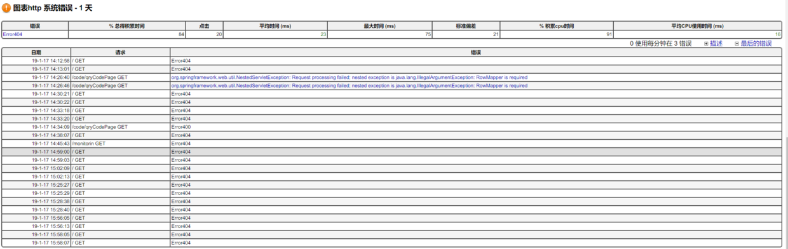

javamelody是用来监控java项目的，和之前介绍的psi-probe不同，javamelody只能监控一个项目，也就是说，你的每个项目都需要一个javamelody，它是一个jar包，你也可以理解成一个插件。

它提供一些图表让你知道项目的运行情况，可以按天、周、月、年、全部（从运行至今）来查看监控信息。这些信息是持久化的，保存在tomcat的temp目录下，里面有一些rrd文件。

对我来说，其最大的用处是用来监控sql，本文主要讲spring集成javamelody。如果本文不能对你提供帮助，请尝试阅读项目[UserGuide](https://github.com/javamelody/javamelody/wiki/UserGuide)或者项目[GitHub地址](https://github.com/javamelody/javamelody)

UserGuide里面还包括了javamelody和hibernate集成、安全管理器，真实用户体验等内容，由于我暂时用不到，没深入研究，在此抛砖引玉。


本文环境：JDK8 ( javamelody要求JDK6以上 ) + apache-tomcat-7.0.88 + Spring 4.1.4 + javamelody1.71.0，数据库用的是Spring自带的JdbcTemplete


## 安装
#### 添加依赖jar包
这里我用的是gradle，javamelody版本是1.71.0，下面也有maven依赖。
```
//gradle 
compile group: 'net.bull.javamelody', name: 'javamelody-core', version: '1.71.0'

//maven
<dependency>
	<groupId>net.bull.javamelody</groupId>
	<artifactId>javamelody-core</artifactId>
	<version>1.71.0</version>
</dependency>
```

#### 配置web.xml
这里需要注意的是官方说如果servlet API版本是在3.0以上的可以不用再web.xml里面配置东西，因为3.0以上支持模块化，即javamelody的jar包就是一个模块，jar包里面的META-INF/web-fragment.xml配置了启动javamelody的相关信息。

查看web.xml是否有声明版本信息比如version="3.0"就知道是什么版本。

我的web.xml声明的是version="3.1"，按理说不用配置什么也能开启，但是第一次失败，我在web.xml里面配置了相关的filter/listener才开启，后来我又注释掉了依然可以用，反正，如果开启不了，加上一下配置信息试一下。

而且，javamelody的web-fragment.xml配置默认是不带登录验证的，这样谁都可以访问，及其不安全，下面的配置带登录验证。

```
<!--javamelody 监控项目-->
<filter>
	<filter-name>javamelody</filter-name>
	<filter-class>net.bull.javamelody.MonitoringFilter</filter-class>
	<async-supported>true</async-supported>
	<init-param>
		<!--添加登录验证，默认是不带登录验证的-->
		<param-name>authorized-users</param-name>
		<param-value>tomcat1:1, tomcat2:2</param-value>
	</init-param>
</filter>
<filter-mapping>
	<filter-name>javamelody</filter-name>
	<url-pattern>/*</url-pattern>
	<!--用来开启异步调用-->
	<dispatcher>REQUEST</dispatcher>
	<dispatcher>ASYNC</dispatcher>
</filter-mapping>
<listener>
	<listener-class>net.bull.javamelody.SessionListener</listener-class>
</listener>
```
下面是和Spring集成，监控JDBC的配置，在Spring的监听器里面将javamelody的sql监控配置加进去。
```
<listener>
	<listener-class>org.springframework.web.context.ContextLoaderListener</listener-class>
</listener>
<context-param>
	<param-name>contextConfigLocation</param-name>
	<param-value>
		classpath:net/bull/javamelody/monitoring-spring.xml<!--javamelody和spring集成用来监控SQL-->
		classpath*:spring-core.xml
	</param-value>
</context-param>
```

#### 开启
最后访问http://ip:port/{你的应用名字}/monitoring，输入上文web.xml里面配置的账号和密码。
- 主页面，上面可以选择时间段


- http监控，可以查看请求接口的信息


- sql监控，查看sql执行信息


- http错误信息，鼠标移上去会有错误详情


- 系统错误信息，鼠标移上去会有应用详情


- 下面是系统和线程的信息


