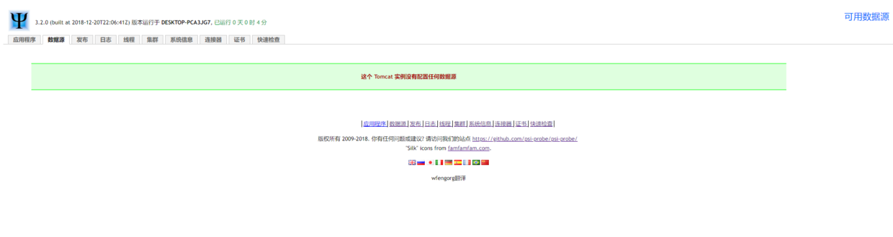
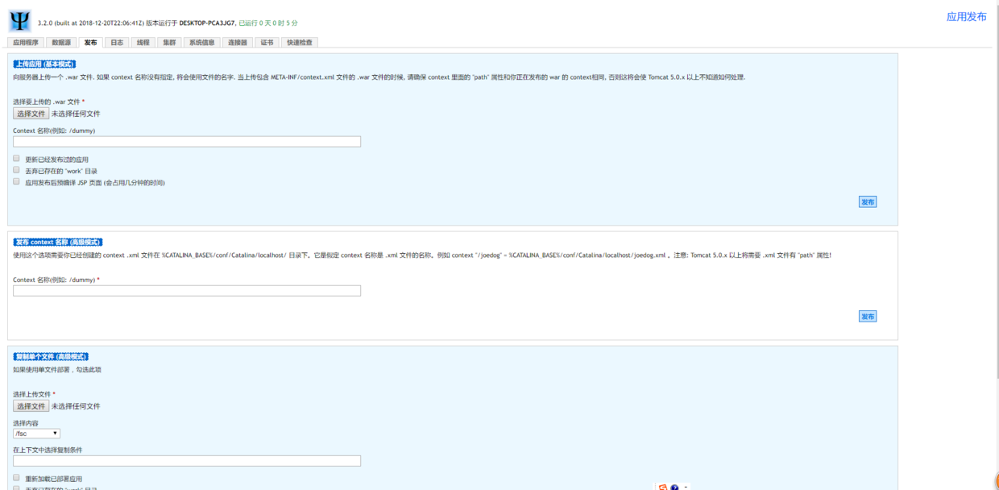

这是一个综合性的监控项目，可监控单个项目、多个项目、监控JVM内存信息、查看日志、发布项目等。

**psi-probe**本身是一个web项目，一个war包，可以直接放在tomcat的webapps目录下运行。psi-probe前身是LambdaProbe，不过这货不更新了，有人fork了这个项目并开发更新到现在，psi是希腊字母Ψ，代表此项目是一个fork的项目。

功能：
**监控单个/多个项目**：包括请求数量、响应时间、查看/编译JSP、操作会话、发布整个项目、发布某个文件、监控/下载日志、监控线程等
**监控Tomcat**：监控连接器请求情况。
**监控JVM**：查看操作系统信息、监控JVM内存信息等
还有数据源监控，Tomcat集群等，总之，是一个比较综合性的监控项目。

## 安装
环境：apache-tomcat-9.0.14 + psi-probe 3.2.0
Github[发布页面](https://github.com/psi-probe/psi-probe/releases)下载 psi-probe 3.2.0 war包，如果是部署新的tomcat需要修改以下三个端口，文件位置:./conf/server.xml
```
<!--修改shutdown端口-->
<Server port="新端口号" shutdown="SHUTDOWN">

<!--修改HTTP connector(连接器)端口-->
<Connector port="新端口号" protocol="HTTP/1.1" connectionTimeout="20000" redirectPort="8443" />

<!--修改AJP connector(连接器)端口-->
<Connector port="新端口号" protocol="AJP/1.3" redirectPort="8443" />
```
添加manager-gui用户，用于登录probe，文件位置:./conf/tomcat-users.xml
```
<role rolename="manager-gui"/>
<!--配置probe登录用户名和密码-->
<user username="tomcat" password="1" roles="manager-gui"/>
```
访问http://ip:port/probe，输入用户名和密码访问。

## 使用
- 总览，点击下面过期可以换语言。


- 选择某个项目，右边有可对该项目进行的操作，如JSP查看，servlet查看，session操作等。

- 数据源不知咋配，没用过

- 发布页面挺有用的，可以发布新项目，更新旧项目或者更新单个文件。

- 日志页面，可以下载日志，查看日志，对于不方便连接服务器的时候挺有用


- 查看线程信息


- 集群没用过，有哪位老铁知道的可以告诉我

- 系统信息，可以查看JVM内存使用，操作系统的相关信息


- Tomcat连接器信息

更多功能可自行研究


