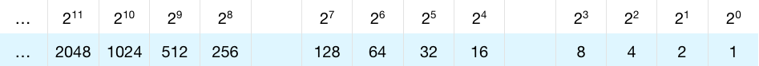
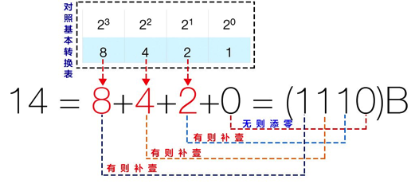
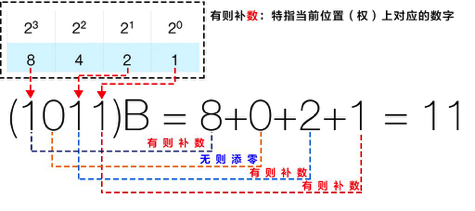
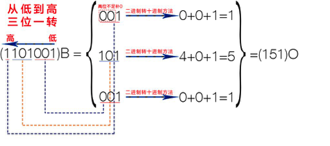
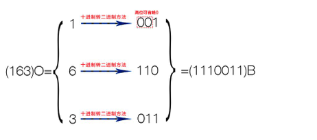
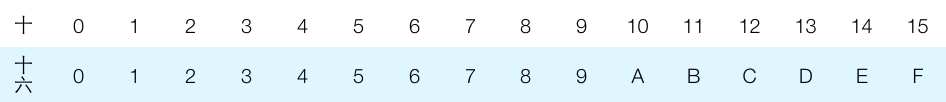
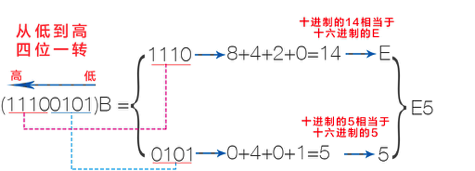
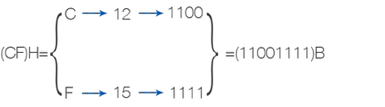

史上最简单的进制互转，如果你要是看完没懂得话，欢迎打我，**我最喜欢看你一言不合就打赏的样子~~~！！！**

本文以**二进制与十进制**的互转为核心，**八进制与二进制、十六进制与二进制**的互转为基础，作为其他进制相互转换的桥梁，只要你会以上三种进制的互转，那么二、八、十、十六任意进制之间的互转都没问题。
## 基本约定
B（Binary)表示二进制，O（Octal）表示八进制，D（Decimal）或不加表示十进制，H（Hexadecimal）表示十六进制。例如：(1111)B = (17)O = 15 = (F)H

## 二进制与十进制的相互转换

( Binary  <<==>> Decimal )

**基础量表**：从右往左开始递增，无限延长，八位一节( 8bit is a byte )

-  Decimal —> Binary ( 10 —> 2 )：心存量表，无则填0，有则补1。
举个栗子 

将14转换成二进制，对照基本量表，14由8、4、2的和组成，有数字的地方添加1，无数字的地方补上零即可。

再举一例：
 (128 64  32  16   8   4    2   1) 量表，存找离72最接近的数是64，在找和64之和为72的数
72＝0+64＋0＋0＋8＋0＋0＋0 ＝ (0100 1000)B //注释:最好四位四位的写:0100 1000，最高位(从右往左次低到高)0可以去掉，即:100 1000。**量表里的数可以凑成任意数。**

- Binary—> Decimal ( 2 —> 10 )：心存量表，无则加零，有则补权数(指当前位置上对应的数)。

再举一例：(110 0110 1101)B = 1024 + 512 + 64 + 32 + 8 + 4 + 1 = 1645
总结：**二进制和十进制的相互转换时其他进制相互转换的基础**，务必掌握；其中，**二进制量表**是关键，熟记量表，就能快速组合出想要的数，其实很简单….2048 1024 512 256   128 64 32 16   8 4 2 1
## 二进制与八进制的相互转换

( Binary  <<==>> Octal )

八进制，Octal，缩写OCT或O，一种以8为基数的计数法，采用0，1，2，3，4，5，6，7八个数字，逢八进1。
-  Binary—> Octal ( 2 —> 8 )：由低到高，三位一转
每三位当成一个单独的二进制，最高位为3，所以(111)B = (7)O不会超过八进制的7

- Octal—> Binary ( 8 —> 2 )：2进制转8进制的逆向操作

**总结：2进制于8进制的转换要以2进制与10进制的转换为基础，注意每个三位当成一个单独的二进制。**
## 二进制与十六进制的互转

( Binary <<==>> Hexadecimal )

十六进制（英文名称：Hexadecimal），是计算机中数据的一种表示方法。同我们日常生活中的表示法不一样。它由0-9，A-F组成，字母不区分大小写。与10进制的对应关系是：0-9对应0-9；A-F对应10-15；N进制的数可以用0~(N-1)的数表示，超过9的用字母A-F。
 基础量表：十进制与十六进制的基本转换（上行为十进制，下行为十六进制）

-  Binary—> Hexadecimal ( 2 —> 16 )由低到高，四位一转



- Hexadecimal—> Binary ( 16 —> 2 )：二进制转十六进制的逆向操作


**总结：和二进制与八进制转换同理，以二进制与十进制的转换为基础，融入了简单的十进制与十六进制的转换，也要注意把每四位看作单独的二进制。**

## 其他进制的互转
以上详略解析了二进制与八、十、十六进制的相互转换，其实剩下的十进制与八进制的互转、十进制与十六进制的互转以及八进制与十六进制的互转都是以他们为基础的。以下举简单栗子。

- **八进制与十进制的互转（以二进制为桥梁）**
1. 八进制转十进制：先将八进制转换成二进制，再将二进制转换为十进制。
```
(345)O = (1110 0101)B = 229
```
2. 十进制转八进制：先将十进制转换成二进制，再将二进制转换为八进制。
```
523 ＝ (1000001011)B = (1013)O
```

- **十六进制与十进制的互转（以二进制为桥梁）**
1. 十六进制转十进制：先将十六进制转换成二进制，再将二进制转换为十进制。
```
(4FE)H = (100 1111 1110)B = 1263
```
2. 十进制转十六进制：先将十进制转换成二进制，再将二进制转换为十六进制。
```
129 ＝ (1000 0001)B = (81)H
```


- **八进制与十六进制的互转（以二进制为桥梁）**
1. 八进制转十六进制：先将八进制转换成二进制，再将二进制转换为十六进制。
```
(74)O = (11 1100)B = (3C)H
```
2. 十六进制转八进制：先将十六进制转换成二进制，再将二进制转换为八进制。
```
(6E)H = (0110 1110)B = (156)O
```