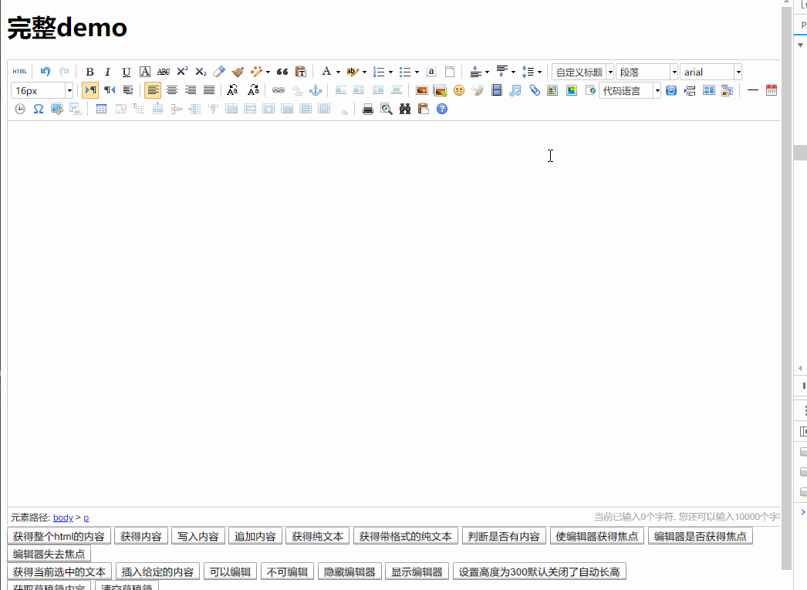

# 项目地址


# Java-Ueditor-ImgBed

Ueditor 集成新浪图床，实现图片上传到新浪图床，下载远程主机上的图片再上传到新浪图床（粘贴带图片的文章时会用到）；请注意，这只是一个简单的Demo，可以无缝集成到其他JavaWeb项目中去。

项目采用gradle构建，经典的SpringMVC项目，建议用IDEA自动导入

Java-Ueditor-ImgBed/ueditor/src/main/webapp/resources/ueditor目录下的内容为从Ueditor官网下载的内容，原封不动放到了里面

Java-Ueditor-ImgBed/ueditor/src/main/java/com/xxoo/support/ueditor目录下的内容为Ueditor Java后端的内容，已修改为支持图床上传，后续会考虑支持更多图床。

附上Ueditor官方下载链接https://ueditor.baidu.com/website/download.html#ueditor

[Github地址](https://github.com/scriptwang/Java-Ueditor-ImgBed)

# 食用方法
1. clone项目，用IDEA导入，gradle自动构建（不赘述，具体请参考IDEA导入gradle项目）
2. 修改配置
```
1. Java-Ueditor-ImgBed/ueditor/src/main/webapp/config.json
配置文件控制是否上传图片到图床，具体是以下四个字段控制:
image2PicBed
imageWitchPicBed
catcher2PicBed
catcherWitchPicBed

2.Java-Ueditor-ImgBed/ueditor/src/main/java/com/xxoo/support/ueditor/upload/PicBed.java
SINA_USERNAME修改为你的微博账号
SINA_PASSWORD修改为你的微博密码

```
2. Tomcat启动，假设端口是8080
3. 访问 http://localhost:8080/resources/ueditor/index.html 

# 图示
## 上传图片


## 远程上传（粘贴图片时）


觉得还好用的点一个小星星吧^ ^ ~，或者请作者喝一杯咖啡~~~

