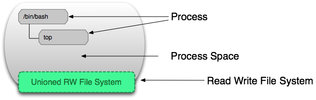

最近几年容器技术异常火热，作为**容器技术代表**的docker自然也炙手可热，简直就是软件界的网红，这么火的docker早就已经应用在生产环境中，国内容器圈内最具代表性的大厂就是阿里和京东。

京东从14年开始在生产环境进行容器化部署，15年618，京东跑了15万个docker实例，到目前为止已经实现了100%应用容器化部署，根据CNCF（Cloud Native Computing Foundation）数据统计，世界上最大的docker集群部署在京东！ [与京东交谈：Kubernetes、云原生和CNCF项目推动大数据和AI](https://www.kubernetes.org.cn/4407.html)
> 京东首席架构师刘海锋：京东是Kubernetes最早期采用者之一。公司目前管理世界上最大的Kubernetes集群，多集群超过20,000多个裸机服务分布在多个地区的数据中心。

既然docker这么火，那么我们就来聊一聊docker的前世今生。

## docker前世
时间回到2010年，几个大胡子年轻人从美国知名创业孵化器Y Combinator毕业后，在旧金山成立了一家做PaaS 平台的公司，名叫**「dotCloud」**，其最主要的创始人是**「Solomon Hykes」**。

PaaS 的全称为 Platform as a Service，翻译成中文就是平台即服务，在这种模式中，客户不需要购买硬件和软件，只需要利用PaaS平台，就能够创建、测试和部署应用和服务。

dotCloud在当时的商业模式为：以多语言PaaS为卖点，使得用户可以选择不同的开发组件和语言来运行程序。

事实上由于开发者/程序员是一种很奇怪的动物，虽然他们常常分不清楚女友的发型衣服款式和口红色号，但对开发工具和开发环境却异常敏感，所以PaaS概念虽好，但由于认、技术理念的局限性，市场的规模不够大，市场接受度也并不高，因此dotCloud的客户逐渐成熟饱和。

而且随着微软、谷歌、亚马逊、IBM等大厂纷纷加入PaaS平台，竞争更是异常激烈，dotCloud的成长变得非常缓慢，可谓是举步维艰，期投资人Peter Fenton说dotCloud在2012年的挣扎，就像温水煮青蛙。
面对那段艰困的时期，在2013年3月份，dotCloud创始人Hykes做了一个在现在看来无比正确的决定：将核心技术**开源**，开源也就是开放源代码，让全世界的开发者贡献自己的代码。

**山重水复疑无路，柳暗花明又一村**

开源后越来越多的工程师开始发现这项技术的优点，人气迅速攀升，速度之快，令人咋舌。这项技术，就是**docker**，使用Go语言。

3月开源，在3月底就发布了docker 0.1版本，此后几乎每个月都有一个新版本产生，2014年6月，docker第一个里程碑版本1.0发布，到2017年2月8日，docker更新到1.13.1（[更新日志](https://docs.docker.com/release-notes/docker-engine/)），此后又分为了[docker CE](https://docs.docker.com/engine/release-notes/)（社区版）和[docker EE](https://docs.docker.com/engine/release-notes/)（商业版）。

docker迅速成长为云计算相关领域最受欢迎的开源项目，没有之一，甚至亚马逊、谷歌、IBM、微软、Red Hat 甚至虚拟化巨头 VMware 都表示全力支持 docker。

13年10月，dotCloud因此也将公司名字改为Docker Inc.，开始专心研发docker，第二年8月docker把PaaS业务dotCloud出售给位于德国柏林的PaaS提供商cloudControl，然而在2016年2月29日，cloudControl宣布破产，那个孕育docker的dotCloud也随之消失在历史长河中。

如果没有开源，docker可能会慢慢在云计算的大潮中销声匿迹。Hykes也不讳言地透露，他之前一直认为docker这名字糟透了。“我们一定要在发布它以前换掉这个名字。”没想到docker容器中的App下载量目前高达53.5亿，一跃成为无人不晓的容器界网红。

## docker是啥？

### 以下分别是来自[维基百科](https://zh.wikipedia.org/wiki/Docker)和[百度百科](https://baike.baidu.com/item/Docker)的解释：
>Docker是一个开放源代码软件项目，让应用程序布署在软件容器下的工作可以自动化进行，借此在Linux操作系统上，提供一个额外的软件抽象层，以及操作系统层虚拟化的自动管理机制。Docker利用Linux核心中的资源分离机制，例如cgroups，以及Linux核心命名空间（name space），来建立独立的软件容器（containers）。这可以在单一Linux实体下运作，避免启动一个虚拟机器造成的额外负担。

> Docker 是一个[开源](https://baike.baidu.com/item/%E5%BC%80%E6%BA%90/246339)的应用容器引擎，让开发者可以打包他们的应用以及依赖包到一个可移植的容器中，然后发布到任何流行的 [Linux](https://baike.baidu.com/item/Linux) 机器上，也可以实现[虚拟化](https://baike.baidu.com/item/%E8%99%9A%E6%8B%9F%E5%8C%96/547949)。容器是完全使用[沙箱](https://baike.baidu.com/item/%E6%B2%99%E7%AE%B1/393318)机制，相互之间不会有任何接口。

术语解释术语对于新人来说是解释不清楚的。

### 用通俗易懂的话来解释一下docker

- docker第一句口号是：**build、ship、run**(创建、运输、运行)
- 

有一个口袋，你可以把你需要的各种软件放进去，然后用根绳儿把口袋系死，口袋系死就不允许在往里面放东西了（只读），这个口袋本身也是一个文件，这个文件我们给他取名儿叫**「镜像文件」**，放软件，系口袋的过程我们叫做创建镜像，官方术语叫**「build」**。

世界上有一个仓库，里面装满了各种各样别人系好的口袋，我们把这个口袋复制一份并运输我们自己的家里，这个仓库叫[docker hub](https://hub.docker.com/)，整个运输过程叫做运输镜像，官方术语叫**「ship」**。

当我们在用口袋里面的软件的时候，docker其实做了两件事，第一步将口袋整个复制（暂且这么理解）一份，第二步解开复制的口袋（可写）并且运行里面的软件，被复制的口袋就是上面创建的「镜像文件」，复制出来的那个口袋我们叫做**「容器」**，口袋可以被复制出很多份，一个镜像可以创建多个容器。这个过程官方术语叫做**「run」**。

口袋有啥用？来看看第二句口号：

- docker的第二句口号：**Build once，Run anywhere**(创建一次，到处运行)

这个不难理解，比如大熊要创建一个网站，我从仓库里面复制一个口袋回来，运行；胖虎也要创建一个一样的网站，重复上面的过程即可。

那如果大熊要创建两个一样的网站呢？很简单，重复一次**「run」**动作即可。

**docker把创建网站这件事变得超级简单，并且这个过程可移植，你不需要去关心底层是怎么做的！这才是docker真正的魅力所在，当然创建网站也可以是做任何其他事情。**

### 下面是网上流传得比较广的一种解释
在1960年以前，货物航运是一件极其痛苦的事情，不同的货物需要不同的运输方式。

大多数货物都是散装运输。托运人和承运人都需要担心不同类型货物之间的不良相互作用（例如，如果一批铁桶压在香蕉上），同样，不同运输方式之间的转换是不易控制的。
因此就存在了M种货物和N种运输工具的运输矩阵，也就是一个MxN的矩阵

于是人类发明集装箱来解决了这个问题，不管是开心果还是保时捷，任何货物都可以放在标准的集装箱内，然后密封，等到了目的地再重新打开。
在到达目的地之前，集装箱可以装载和卸载，堆叠，运输并且有效地长距离移动。如今，1800万标准集装箱占世界贸易量的90％，许多人认为，集装箱的出现改变了世界的运输业。

可以将货类比成各种软件或各种服务，运输方式类比成各种硬件或各种平台，现实中开发人员一般使用多种服务在开发环境中构建应用，这些应用需要部署到生产环境中，而生产环境有可能是物理服务器、虚拟服务器‘私有云或公有云。

因此，也就形成了和运输业类似的MxN矩阵

docker的出现解决了这个问题，docker直译成中文就是**「码头工人」**，docker可以将任何应用程序及其依赖项打包成轻量级的，可移植的，自给自足的标准化**容器**（Container）中，这个容器，就是装代码的集装箱（“集装箱”和“容器”对应的英文都是Container）。此容器具有标准化操作，几乎可以在任何Linux服务器上运行。

## docker优势
- **快、轻量**
运行时性能可以获取极大提升（经典的案例是提升97%），管理操作（启动，停止，开始，重启等等） 都是以秒或毫秒为单位的。业界经常将虚拟机和容器作对比。
- **成本降低**
和虚拟机相比，docker占用硬件系统资源少得多，在一定程度上降低了硬件采购的成本，当然，docker并不是为了取代虚拟机的，docker只能提供进程上的隔离，而虚拟机提供的是操作系统的资源隔离，这两者是有区别的。
- **服务移植**
Build once，Run anywhere最能体现服务的可移植性，docker容器能移植到任何运行 docker的操作系统上。无论是 Ubuntu 还是 CentOS，只要 docker运行着，你的容器就能运行。笔者最明显的感受就是每次安装LNMP环境时不用跑一键脚本了。
- **资源隔离**
docker运行Linux kernel的CGroup和namespace技术进行资源隔离，容器里面环境和主机运行环境互不干扰，容器崩溃也不会影响主机。
- **安全性高**
这一点是和资源隔离紧密联系的，docker将应用放到容器里面并将资源和主机隔离，使其不会暴露真正的运行时环境，提高了安全性。
- **版本控制**
docker 通过镜像文件来进行分发，并通过镜像仓库解决了分发问题，只要下载这个镜像，在任何装有 docker 环境的机器上，通过 docker run 就能运行起来。而每一个镜像文件都可以打上不同的 tag 从而实现了对 docker 镜像文件的版本控制。
- **环境统一**
有一句话是这么说的，开发人员的电脑是最脏的，请你不要碰！各种运行时环境，各种运行时库，各种构建工具，同一软件的各种版本，这些东西全塞在了开发人员电脑里面，有时候这些软件会相互作用，产生莫名其妙的问题；而测试环境和生产环境一般只需安装目标代码的运行时环境，这些环境的不统一会导致各种各样的问题，docker的出现统一了这些环境。
- **便利**
docker hub作为docker的镜像仓库，里面存放了成千上万的镜像，拉取镜像十分方便，但国内网络环境比较复杂， 一般情况下连接不上docker hub，需要换成国内镜像源，国内大厂阿里、网易等都有docker镜像源。

## 虚拟机 VS 容器
在容器技术之前，业界的网红是虚拟机，业界流行的虚拟机和容器对比图。

- 容器
  容器和虚拟机具有相似的资源隔离和分配优势，但功能有所不同，因为容器虚拟化的是操作系统，而不是硬件，因此容器更容易移植，效率也更高。
  

  容器是一个应用层抽象，用于将代码和依赖资源打包在一起。多个容器可以在同一台机器上运行，共享操作系统内核，但各自作为独立的进程在用户空间中运行。与虚拟机相比，容器占用的空间较少（容器镜像大小通常只有几十兆），瞬间就能完成启动。

- 虚拟机
  虚拟机 (VM) 是一个物理硬件层抽象，用于将一台服务器变成多台服务器。管理程序允许多个 VM 在一台机器上运行。每个 VM 都包含一整套操作系统、一个或多个应用、必要的二进制文件和库资源，因此占用大量空间。而且 VM 启动也十分缓慢。

- **容器可以在虚拟机里面运行，两者可共存**
现在的VPS都是基于虚拟化的，VPS中可以安装docker；也可以在Windows中通过Vmware安装Linux虚拟机，在Linux虚拟机中安装docker。

## docker原理
docker作为容器技术的代表，其核心技术在linux内核里面存在很久了，docker对其进行了进一步封装。
docker利用Linux kernel中的资源分配机制CGroups，以及Linux核心名字空间namespace来进行进程级别的资源隔离。

### namespace
docer的底层对namespace的隔离主要是通过下面3个系统函数来实现的：
  -  clone() ：实现线程的系统调用，用来创建一个新的进程，并可以通过设计上述参数达到隔离。对函数送不同的参数实现对存储、网络、进程、用户等环境层面的隔离，具体函数可以参考C++函数库。
  - unshare() ： 使某进程脱离某个namespace，可以通过该函数将进程从某个容器中剥离
  - setns() ： 把某进程加入到某个namespace，可以通过该函数将进程控制在某个容器中，防止被跨容器访问

### CGroup
Linux CGroup全称Linux Control Group， 是Linux内核的一个功能，用来限制，控制与分离一个进程组群的资源（如CPU、内存、磁盘输入输出等）。

### AUFS联合文件系统
在传统的linux引导过程中，root文件系统会最先以只读的方式加载，当引导结束并完成了完整性检查后，才会被切换到读写模式。

但是在docker中，root文件系统永远都只能是只读的，并且docker利用union mount（AUFS）技术在root文件系统层面加载更多的只读文件系统。

union mount将各层文件系统叠加在一起，这些文件组成了一个镜像，一个镜像会包含所有底层的文件和目录。一个镜像可以放到另一个镜像的顶层，位于下面的镜像称为父镜像。

最后，当从一个镜像启动容器时，docker会在镜像的最顶层加载一个读写文件系统，只有最顶层的的容器部分是可读写的。

当容器运行后，文件系统发生变化都会体现在这一层，当改变一个文件的时候，这个文件首先会从下面的只读层复制到读写层，然后读写层对该文件的操作会隐藏在只读层的该文件，这就是传说中的copy on write。

容器是可写的，镜像是只读的。如果有很多镜像的话，比如本地主机有很多很多的镜像，很多的镜像有些层是可以共享的，可能，有些层他们之间是一样的，一样的话，这些层只会占用一个空间，达到节省空间达到目的。

可以同个一个镜像，启动很多个容器，这些容器它共用的都是这一个镜像，它不像虚拟机似得，如果有一个虚拟机是100G，我又启动了一个，它又会占用100G，它的内存资源是非常消耗的。
然而容器是共有这一个镜像，不会启动很多很多的容器，非常的省资源，下面这张图比较形象的表示了docker容器和镜像的物理关系。

### docker镜像与容器详解
镜像和容器是docker的核心概念之一，docker采用AUFS联合文件系统，容器是可写的，镜像是只读的。

镜像（Image）就是一堆只读层合成的。

其中除了最底层，上面的每一层都指向父级。

一个镜像层包括id，指向父级的指针和当前层的元数据。

容器（container）和镜像最大区别就是容器最上面有一层读写层。

一个运行态容器（running container）被定义为一个可读写的统一文件系统加上隔离的进程空间和包含其中的进程。

## 结语
有人说容器技术不火了，也有人说2018年才是容器技术真正大规模落地的元年，2018年3月docker之父Solomon Hykes宣布已正式从 docker 公司[离职](https://www.oschina.net/news/94685/solomon-hykes-announces-departure-from-docker)，不再担任公司的日常运作工作，太多不确定因素，到底docker会走向何方，让我们拭目以待。

扩展阅读：[你不知的Docker 创办人兼CTO游走美法的浪漫狂放](https://www.csdn.net/article/2015-07-07/2825153-docker)

## 参考
- https://viethip.com/2014/03/05/docker-a-linux-container/
- https://www.csdn.net/article/2015-07-07/2825153-docker
- http://dockone.io/article/783
- http://merrigrove.blogspot.com/2015/10/visualizing-docker-containers-and-images.html
- https://zhuanlan.zhihu.com/p/53260098
- https://zhuanlan.zhihu.com/p/39277098
